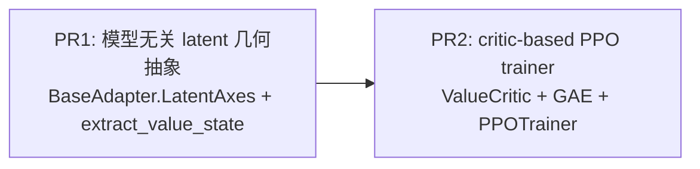
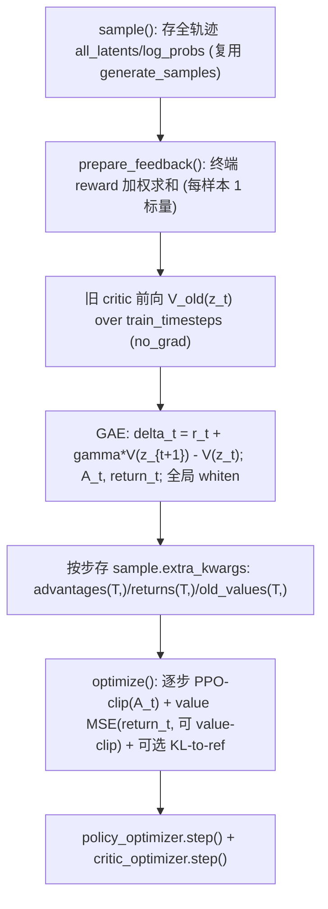

# Roadmap：模型无关 latent 状态抽象 + critic-based PPO

分两个 PR 推进。PR1 是独立、可单独合并的基础设施；PR2 依赖 PR1。**当前先专注 PR1。**



## 已确认的背景

- 框架已具备 PPO 的全部「非 critic」要素：逐步重要性比+裁剪（[grpo.py](src/flow_factory/trainers/grpo.py) `optimize()` L194-205）、逐步 `log_prob`（[scheduler/flow_match_euler_discrete.py](src/flow_factory/scheduler/flow_match_euler_discrete.py) `Flow-SDE`）、ODE→SDE（`dynamics_type`）、KL 正则（`kl_beta`）。**全代码无 critic/value/GAE**（已 grep 确认）。
- 现优势是「每样本一个标量」存于 `sample.extra_kwargs['advantage']`（[advantage_processor.py](src/flow_factory/advantage/advantage_processor.py) L517-518），广播到所有步；critic-based PPO 改为「每步一个优势/回报」。
- 已核查全部 14 个 adapter，latent 共 3 种 layout，可由 `ndim` 唯一区分：
  - rank 3 `(B, Seq, C)`（FLUX.1/Kontext/2/Klein、Qwen-Image/Edit-Plus、LTX2 T2AV/I2AV、Bagel）→ `channel=-1, sequence=1`
  - rank 4 `(B, C, H, W)`（SD3.5、Z-Image）→ `channel=1, spatial=(2,3)`
  - rank 5 `(B, C, T, H, W)`（Wan2 T2V/I2V/V2V）→ `channel=1, temporal=2, spatial=(3,4)`
- trainer 必须直接继承 `BaseTrainer`（约束 #12），故 `PPOTrainer(BaseTrainer)`，复用 GRPO 靠复制/helper 而非继承。

---

# PR1：模型无关的 latent 状态抽象（当前焦点）

**目标**：在 adapter 层引入一个分辨率无关、模型无关的 latent 几何描述与状态抽取 API，作为 value/critic 类方法的统一地基。可独立合并、独立测试，不引入任何算法。

## 设计

不存「具体 latent_shape」（随分辨率/帧数/参考图数动态变化），只记**轴角色**；channel 数 C 运行时从 `latents.shape[channel]` 读取。注意 API 是「带 latent 的解析器」而非无参 property —— 默认要靠运行时 `ndim` 推断，类在没有 latent 时不知道自己的 rank。

```python
# src/flow_factory/models/latent_axes.py
class LatentLayout(Enum):
    PACKED = "packed"   # (B, Seq, C)
    CONV   = "conv"     # (B, C, H, W)
    VIDEO  = "video"    # (B, C, T, H, W)

@dataclass(frozen=True)
class LatentAxes:
    batch: int = 0
    channel: int = -1
    spatial: tuple[int, ...] = ()
    temporal: Optional[int] = None
    sequence: Optional[int] = None
```

```python
# src/flow_factory/models/abc.py (BaseAdapter, additive)
LATENT_AXES: ClassVar[Optional[LatentAxes]] = None   # 非标准 layout 的模型在此覆写

def resolve_latent_axes(self, latents: torch.Tensor) -> LatentAxes:
    if self.LATENT_AXES is not None:
        return self.LATENT_AXES
    nd = latents.ndim
    if nd == 3: return LatentAxes(channel=-1, sequence=1)
    if nd == 4: return LatentAxes(channel=1, spatial=(2, 3))
    if nd == 5: return LatentAxes(channel=1, temporal=2, spatial=(3, 4))
    raise ValueError(
        f"Cannot infer LatentAxes for latents with ndim={nd} (shape={tuple(latents.shape)}); "
        f"override `LATENT_AXES` on {type(self).__name__}."
    )

def extract_value_state(self, latents: torch.Tensor) -> torch.Tensor:
    """(B, 2C) 分辨率无关状态：对非 batch/非 channel 维 mean+std 池化。
    特殊模型(LTX2 视频/音频拆分、未来 condition-aware I2V)可 override。"""
    axes = self.resolve_latent_axes(latents)
    cdim = axes.channel % latents.ndim
    reduce = [d for d in range(latents.ndim) if d not in (0, cdim)]
    return torch.cat([latents.mean(reduce), latents.std(reduce)], dim=-1)
```

- 默认 `ndim` 推断对全部 14 个 adapter 正确，**零必需改动**；特殊模型设静态 `LATENT_AXES` 即可覆写。
- packed 模型 H/W(/T) 被 patchify 折进 `Seq`，无法在不引入 pack 元数据下拆出独立 spatial/temporal，故其 `spatial=()/temporal=None` 是如实表达。
- `spatial/temporal/sequence` 当前无消费者，为完整几何描述与未来 temporal/structure-aware value 预留（已与用户确认要补齐）。
- fail-fast：未知 ndim 直接 `raise`（遵守 no-defensive-except）。

## 文件

- 新增 `src/flow_factory/models/latent_axes.py` — `LatentLayout` + `LatentAxes`。
- 编辑 [src/flow_factory/models/abc.py](src/flow_factory/models/abc.py) — `LATENT_AXES` 覆写位 + `resolve_latent_axes()` + `extract_value_state()`（additive、有默认、不破坏现有子类；遵守 base-class-contract）。
- 新增 `tests/models/test_latent_axes.py` — 单测（不加载真实权重，用合成张量）。
- 编辑 [.agents/knowledge/topics/adapter_conventions.md](.agents/knowledge/topics/adapter_conventions.md) — 记录 latent 几何 API + 三 layout 轴角色 + 每模型对照表。

## 验收标准

- `resolve_latent_axes` 对合成 rank 3/4/5 张量返回正确轴；rank 2/6 抛 `ValueError`（含 shape）。
- `extract_value_state` 形状正确：`(B,Seq,64)->(B,128)`、`(B,16,H,W)->(B,32)`、`(B,16,T,H,W)->(B,32)`。
- 覆写路径：设 `LATENT_AXES` 后走覆写而非 ndim 推断。
- 纯 additive，无任何 adapter/trainer 行为变化；`black --check src/ && isort --check src/` 通过；`pytest tests/models/test_latent_axes.py` 通过。
- 文档更新。

---

# PR2：critic-based PPO trainer（依赖 PR1）

**目标**：基于 PR1 的 `extract_value_state` 实现经典 actor-critic PPO：新增 value 网络 + GAE 逐步优势 + value-clipping，复用现有 rollout/逐步 log-prob/SDE/KL 基础设施。

## 算法（与 GRPO 的差异）



- **Critic 输入**：`adapter.extract_value_state(z_t)` 得 `(B,2C)` + 时间步正弦编码 + 可选 pooled 文本（batch 内有 `pooled_prompt_embeds` 时投影拼接，否则跳过）→ MLP → 标量 `V`。首层惰性构建。
- **GAE**：仅在 `scheduler.train_timesteps`（SDE 步）子序列上做；终端 reward 落最后一步。`gamma≈1.0, lambda≈0.95`；advantage 跨 rank 全局 whiten。
- **损失**：`loss = policy_clip(A_t) + vf_coef*value_loss(return_t) [+ kl_beta*KL_ref]`；value 支持围绕 `old_values` 的 PPO clip。沿用 GRPO 的极小 `clip_range` 默认并可配。
- **Critic 优化**：独立 `critic_optimizer`（独立 LR），与 policy 同一 backward、各自 `step()`；可选 `critic_warmup_steps`。

## 文件

- 新增 `src/flow_factory/trainers/ppo/{__init__,critic,gae,trainer}.py`。
- 新增 `src/flow_factory/hparams/training_args/ppo.py` — `PPOTrainingArguments`。
- 新增 `examples/ppo/lora/sd3_5/default.yaml`（DDP，`trainer_type: ppo`）。
- 编辑 [trainers/registry.py](src/flow_factory/trainers/registry.py) + `trainers/__init__.py` + [hparams/training_args/_registry.py](src/flow_factory/hparams/training_args/_registry.py) + `hparams/training_args/__init__.py` + `hparams/__init__.py` 注册导出。
- 文档：AGENTS.md/README 算法表 + [guidance/algorithms.md](guidance/algorithms.md) PPO 小节。

## `PPOTrainingArguments` 关键字段

- `critic_learning_rate=1e-4`、`vf_coef=0.5`、`gae_gamma=1.0`、`gae_lambda=0.95`
- `value_clip_range=0.2`（None 关闭）、`normalize_advantage=True`、`adv_clip_range`/`clip_range`（沿用）
- `critic_warmup_steps=0`、`critic_hidden_dim`、`critic_num_layers`
- 可选 DPOK 式 `kl_beta/kl_type`；`get_num_train_timesteps -> args.scheduler_args.num_sde_steps`

## 优化器/critic 接入（最小侵入）

`PPOTrainer` 重写 `_initialization()`：先 `super()._initialization()`（准备 policy），再建 `self.critic`+`self.critic_optimizer` 并 `accelerator.prepare(...)`；`optimize()` 用 `accelerator.accumulate(*trainable_components, self.critic)`，一次 backward 两优化器各自 step；重写 `save_checkpoint/load_checkpoint` 持久化 critic。

## 验收标准

- `get_trainer_class('ppo')`/`get_training_args_class('ppo')` 解析成功；black/isort 通过。
- SD3.5 + PickScore 短跑：reward 上升、`value_loss` 下降、`clip_frac`/`ratio` 正常、critic 与 policy 都在更新；与 GRPO 同配置对照。
- 跑 `/ff-review` 后再提交。

---

## 全局已锁定决策

- **Critic 架构**：独立轻量 critic + PR1 的模型无关 seam；「backbone+value head」留 follow-up。
- **条件范围（t2i-first）**：critic 只条件于「生成 latent + 可选 pooled 文本」，不融合 condition latents（对 I2I/I2V/Edit 仍是有效方差基线，因 `all_latents` 本就只存生成 latent，多参考图不影响 critic）；condition 融合 / LTX2 视频音频拆分 / Bagel KV 留 follow-up。
- **验证模型**：主跑 SD3.5（可选 FLUX）；其余模型设计上可跑、暂不逐一验证。
- **分布式**：v1 走 DDP；DeepSpeed ZeRO 下 critic 第二优化器留 follow-up。
