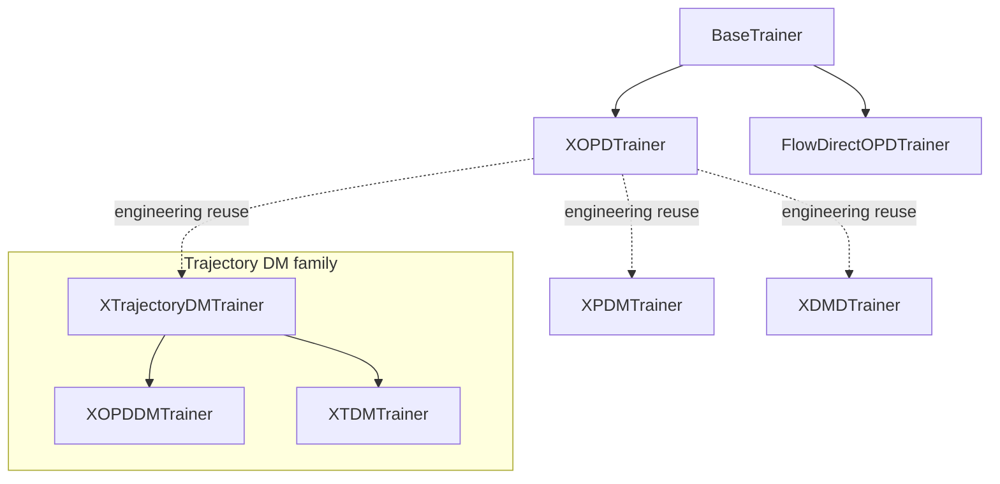

# XOPD documentation index

This directory collects theory, design, implementation notes, diagnostics, and experiment records
for cross-model on-policy distillation. Navigate it on two axes: the **conceptual axis** explains
what a method means, while the **implementation axis** maps registry keys to trainer classes.

## Taxonomy and tags

- **`[class]`**: a distinct objective or trainer family, not merely an option of another method.
- **`[mode]`**: a target mode implemented inside `XOPDTrainer`.
- **`[infra]`**: shared transport, conditioning, scaling, or engineering material used by methods.
- **`[diag]`**: empirical diagnosis, audit, ablation, or progress evidence; not a method definition.

Directory placement is thematic, not an inheritance claim. In particular, `xpdm`, `xdmd`, and
trajectory DM reuse XOPD engineering even when their mathematics is not a specialization of XOPD.

## Conceptual navigation

### XOPD core target modes

- **`[mode]` Direct field matching (A0/A1 context):** the five-arm overview
  ([TeX](core/arms/generalized_popd_five_arm_formalization.tex),
  [PDF](core/arms/generalized_popd_five_arm_formalization.pdf)) is the common taxonomy.
- **`[mode]` A2 forward-risk:** a **theory proposal, not implemented**
  ([TeX](core/forward_risk/arm_a2_forward_risk_popd_tutorial.tex),
  [PDF](core/forward_risk/arm_a2_forward_risk_popd_tutorial.pdf)).
- **`[mode]` A3 P-OPD:** repository `p_opd` is A3, the SDE transition-mixture mode
  ([TeX](core/p_opd/popd_exact_sum_gate_saturation.tex),
  [PDF](core/p_opd/popd_exact_sum_gate_saturation.pdf)). Gate diagnostics:
  [dimension](core/p_opd/figures/popd_gate_dimension.pdf),
  [KL profile](core/p_opd/figures/popd_gate_kl_profile.pdf),
  [loss weight](core/p_opd/figures/popd_gate_loss_weight.pdf), and
  [responsibility](core/p_opd/figures/popd_gate_responsibility.pdf).
- **`[mode]` A4 marginal CFM:** **implemented** as `xopd_target_mode="marginal_cfm"`
  ([TeX](core/marginal_cfm/arm_a4_marginal_mixture_cfm_tutorial.tex),
  [PDF](core/marginal_cfm/arm_a4_marginal_mixture_cfm_tutorial.pdf)).
- **`[infra]` CFG:** [branch-aware CFG distillation](core/cfg/branch_aware_cfg_distillation.md).
- **`[infra]` Shared loss-scale analysis:**
  [per-timestep theory TeX](core/shared/per_timestep_loss_dominance_theory.tex) and
  [PDF](core/shared/per_timestep_loss_dominance_theory.pdf), plus
  [FLUX.2 Klein 28-step scales](core/shared/flux2_klein_28step_loss_scales.tex).
  Checked-in plots:
  [empirical loss share](core/shared/figures/empirical_loss_share_comparison.pdf),
  [empirical LxT scale](core/shared/figures/empirical_lxt_scale_comparison.pdf),
  [training evolution](core/shared/figures/lxt_share_training_evolution.pdf), and
  [flat-\(L_v\) theory](core/shared/figures/theoretical_loss_share_flat_lv.pdf).

### Cross-VAE and transport

- **`[infra]` Problem and bridge:** cross-latent problem
  ([TeX](cross_vae/cross_latent_distillation_problem.tex),
  [PDF](cross_vae/cross_latent_distillation_problem.pdf)) and cross-space bridge
  ([TeX](cross_vae/cross_space_distillation_bridge.tex),
  [PDF](cross_vae/cross_space_distillation_bridge.pdf)).
- **`[infra]` Transport choices:** inverse mapping
  ([TeX](cross_vae/inverse_mapping_methods.tex), [PDF](cross_vae/inverse_mapping_methods.pdf)),
  avoiding inverse transport
  ([TeX](cross_vae/avoid_inverse_transport_analysis.tex),
  [PDF](cross_vae/avoid_inverse_transport_analysis.pdf)), and VAE-space alignment
  ([TeX](cross_vae/xopd_vae_space_align.tex), [PDF](cross_vae/xopd_vae_space_align.pdf)).
- **`[infra]` Alignment implementations:** [stage-1 formulation](cross_vae/vae_align_stage1_formulation.md)
  and [hidden-state transport](cross_vae/xopd_hidden_state_transport.md).
- Bridge figures: [system](cross_vae/figures/cross_space_distillation/system.pdf),
  [loss](cross_vae/figures/cross_space_distillation/loss.pdf), and
  [teaser](cross_vae/figures/cross_space_distillation/teaser.pdf).

### Distribution matching

- **`[class]` XPDM:** pixel/latent denoiser matching
  ([TeX](xpdm/pixel_denoiser_matching.tex), [PDF](xpdm/pixel_denoiser_matching.pdf)).
- **`[class]` XDMD:** [cross-model design](xdmd/dmd_cross_model_design.md),
  gradient relation ([TeX](xdmd/dmd_opd_gradient_relation.tex),
  [PDF](xdmd/dmd_opd_gradient_relation.pdf)), and
  [fake-network primer](xdmd/score_matching_fake_network_primer.md).
- **`[class]` Trajectory DM:** XOPD-DM [Approach B design](trajectory_dm/approach_b_trajectory_dm_design.md),
  [TDM design](trajectory_dm/tdm_cross_model_design.md), and
  OPD/DM gradient relation ([TeX](trajectory_dm/tdm_opd_dm_gradient_relation.tex),
  [PDF](trajectory_dm/tdm_opd_dm_gradient_relation.pdf)).

The XDMD design document began as an RFC, but the repository now contains `XDMDTrainer` and an
[implementation report](progress/2026-07-23-dmd-implementation-report.md). The design status line
should therefore be read as document history, not current repository status.

### MoF overlay

- **`[infra]`** Mixture-of-flows is an overlay on compatible objectives, not another XOPD target
  mode. See velocity decomposition
  ([TeX](core/mof/mof_velocity_decomposition_analysis.tex),
  [PDF](core/mof/mof_velocity_decomposition_analysis.pdf)) and the
  [progress analysis](progress/2026-07-21-mof-velocity-decomposition.md).

### Flow Direct OPD

- **`[class]`** Small-RL-delta transfer
  ([TeX](flow_direct_opd/flow_direct_opd_small_rl_delta_transfer.tex),
  [PDF](flow_direct_opd/flow_direct_opd_small_rl_delta_transfer.pdf)).

### Diagnostics

- **`[diag]` Teacher regression:** 9B-to-4B analysis
  ([TeX](diagnostics/9b_to_4b_teacher_regression.tex),
  [PDF](diagnostics/9b_to_4b_teacher_regression.pdf)); figures:
  [below both](diagnostics/figures/9b_teacher_below_both.pdf),
  [reverse separation](diagnostics/figures/9b_teacher_reverse_separation.pdf),
  [matched ODE](diagnostics/figures/ode_9b_vs_32b_matched.pdf), and
  [image drift](diagnostics/figures/ode_9b_vs_32b_image_drift.pdf).
- **`[diag]` Teacher fields:** [analysis](diagnostics/teacher_velocity_field_analysis.md),
  [interactive report](diagnostics/teacher_velocity_field_analysis.html),
  [HY field analysis](diagnostics/hy_teacher_field_analysis.md), and
  [activation capture](diagnostics/teacher_student_activation_capture.md). Checked-in plots:
  [HY full-\(x_0\)](diagnostics/figures/hy_full_x0_metric_curves.pdf),
  [HY teacher field](diagnostics/figures/hy_teacher_field_analysis.pdf), and
  [teacher velocity/\(x_0\)](diagnostics/figures/teacher_velocity_x0_analysis.pdf).

### Synthesis

- **`[class]` proposal:** MoD-DMD/TDM synthesis
  ([TeX](synthesis/mixture_of_density_dmd_tdm_derivation.tex),
  [PDF](synthesis/mixture_of_density_dmd_tdm_derivation.pdf)). Treat it as a proposal unless this
  document is updated with explicit implementation evidence.

### Progress and demos

- Progress records: [HSCT transport fixes](progress/2026-07-01-hsct-transport-fixes.md),
  [ablation relay](progress/2026-07-12-ablation-relay.md),
  [per-timestep dominance](progress/2026-07-12-per-timestep-dk-dominance.md),
  [loss-space ablation plan](progress/2026-07-16-loss-space-ablation-plan.md),
  [DiffusionNFT reweighting](progress/2026-07-23-diffusionnft-adaptive-reweighting.md),
  [DMD implementation](progress/2026-07-23-dmd-implementation-report.md),
  [DMD/OPD gradient relation](progress/2026-07-27-dmd-opd-gradient-relation.md), and
  [TDM Approach B plan](progress/2026-08-02-tdm-approach-b-plan.md).
- Demos: [mixture-of-density notebook](demos/mixture_of_density_demo.ipynb) and
  [score-matching fake toy](demos/score_matching_fake_toy.py).

## Implementation navigation

- **`xopd`** → [`XOPDTrainer`](../../src/flow_factory/trainers/xopd/trainer.py): direct,
  `p_opd` (A3), and `marginal_cfm` (A4) target modes.
- **`xpdm`** → [`XPDMTrainer`](../../src/flow_factory/trainers/xopd/pdm_trainer.py).
- **`xdmd`** → [`XDMDTrainer`](../../src/flow_factory/trainers/xopd/dmd_trainer.py).
- **`xopd_dm`** → [`XOPDDMTrainer`](../../src/flow_factory/trainers/xopd/traj_dm_trainer.py).
- **`xtdm`** → [`XTDMTrainer`](../../src/flow_factory/trainers/xopd/traj_dm_trainer.py).
- **`flow-direct-opd`** →
  [`FlowDirectOPDTrainer`](../../src/flow_factory/trainers/fdopd/trainer.py).



`XPDMTrainer`, `XDMDTrainer`, and `XTrajectoryDMTrainer` inherit from or reuse `XOPDTrainer`
primarily for **engineering reuse** (teacher setup, VAE/transport handling, rollout, evaluation, and
shared utilities), **not mathematical specialization**. `XOPDDMTrainer` and `XTDMTrainer` are the
concrete trajectory-DM variants under `XTrajectoryDMTrainer`.

## Source and artifact policy

- `.md` and `.tex` are authoritative editable sources. A neighboring `.pdf` is a checked-in
  rendered artifact; do not edit it directly.
- Figure `.pdf`/`.png` and diagnostic `.json` files are reproducible evidence when their generating
  script or data source is known.
- LaTeX auxiliary files (`.aux`, `.fdb_latexmk`, `.fls`, `.log`, `.out`, `.toc`, etc.) belong only
  under repository-root `.scratch/`, never under `docs/`.
- From the repository root, regenerate one TeX document with the exact pattern below. It compiles
  from the source's own directory, keeps all temporary files in `.scratch/`, and copies only the PDF
  beside the source:

```bash
repo_root="$(pwd)"
source="docs/xopd/core/arms/generalized_popd_five_arm_formalization.tex"
source_dir="$(dirname "$source")"
source_name="$(basename "$source")"
stem="${source_name%.tex}"
aux_dir="$repo_root/.scratch/latex/${source_dir#docs/xopd/}/$stem"
mkdir -p "$aux_dir"
(cd "$source_dir" && latexmk -xelatex -interaction=nonstopmode -halt-on-error \
  -outdir="$aux_dir" "$source_name")
cp "$aux_dir/$stem.pdf" "$source_dir/$stem.pdf"
```

Change only `source=...` for another TeX file. If the source intentionally has no checked-in PDF,
review the generated PDF before deciding whether to add it.

## Migration index

This index covers all **89 moved paths** in `.scratch/xopd-reorg-mapping.tsv`. Braces compact paired
or bundled files; expand each brace item independently. Unchanged `demos/` and `progress/` entries
are intentionally absent. `docs/xopd/.DS_Store` was removed rather than migrated.

### Sources and rendered documents

- `docs/xopd/9b_to_4b_teacher_regression.{tex,pdf}` →
  `docs/xopd/diagnostics/9b_to_4b_teacher_regression.{tex,pdf}`
- `docs/xopd/approach_b_trajectory_dm_design.md` →
  `docs/xopd/trajectory_dm/approach_b_trajectory_dm_design.md`
- `docs/xopd/arm_a4_marginal_mixture_cfm_tutorial.{tex,pdf}` →
  `docs/xopd/core/marginal_cfm/arm_a4_marginal_mixture_cfm_tutorial.{tex,pdf}`
- `docs/xopd/avoid_inverse_transport_analysis.{tex,pdf}` →
  `docs/xopd/cross_vae/avoid_inverse_transport_analysis.{tex,pdf}`
- `docs/xopd/branch_aware_cfg_distillation.md` →
  `docs/xopd/core/cfg/branch_aware_cfg_distillation.md`
- `docs/xopd/cross_latent_distillation_problem.{tex,pdf}` →
  `docs/xopd/cross_vae/cross_latent_distillation_problem.{tex,pdf}`
- `docs/xopd/cross_space_distillation_bridge.{tex,pdf}` →
  `docs/xopd/cross_vae/cross_space_distillation_bridge.{tex,pdf}`
- `docs/xopd/dmd_cross_model_design.md` → `docs/xopd/xdmd/dmd_cross_model_design.md`
- `docs/xopd/dmd_opd_gradient_relation.{tex,pdf}` →
  `docs/xopd/xdmd/dmd_opd_gradient_relation.{tex,pdf}`
- `docs/xopd/flow_direct_opd_small_rl_delta_transfer.{tex,pdf}` →
  `docs/xopd/flow_direct_opd/flow_direct_opd_small_rl_delta_transfer.{tex,pdf}`
- `docs/xopd/flux2_klein_28step_loss_scales.tex` →
  `docs/xopd/core/shared/flux2_klein_28step_loss_scales.tex`
- `docs/xopd/generalized_popd_five_arm_formalization.{tex,pdf}` →
  `docs/xopd/core/arms/generalized_popd_five_arm_formalization.{tex,pdf}`
- `docs/xopd/hy_teacher_field_analysis.md` →
  `docs/xopd/diagnostics/hy_teacher_field_analysis.md`
- `docs/xopd/inverse_mapping_methods.{tex,pdf}` →
  `docs/xopd/cross_vae/inverse_mapping_methods.{tex,pdf}`
- `docs/xopd/mixture_of_density_dmd_tdm_derivation.{tex,pdf}` →
  `docs/xopd/synthesis/mixture_of_density_dmd_tdm_derivation.{tex,pdf}`
- `docs/xopd/mof_velocity_decomposition_analysis.{tex,pdf}` →
  `docs/xopd/core/mof/mof_velocity_decomposition_analysis.{tex,pdf}`
- `docs/xopd/per_timestep_loss_dominance_theory.{tex,pdf}` →
  `docs/xopd/core/shared/per_timestep_loss_dominance_theory.{tex,pdf}`
- `docs/xopd/pixel_denoiser_matching.{tex,pdf}` →
  `docs/xopd/xpdm/pixel_denoiser_matching.{tex,pdf}`
- `docs/xopd/popd_exact_sum_gate_saturation.{tex,pdf}` →
  `docs/xopd/core/p_opd/popd_exact_sum_gate_saturation.{tex,pdf}`
- `docs/xopd/score_matching_fake_network_primer.md` →
  `docs/xopd/xdmd/score_matching_fake_network_primer.md`
- `docs/xopd/tdm_cross_model_design.md` →
  `docs/xopd/trajectory_dm/tdm_cross_model_design.md`
- `docs/xopd/tdm_opd_dm_gradient_relation.tex` →
  `docs/xopd/trajectory_dm/tdm_opd_dm_gradient_relation.tex`
- `docs/xopd/teacher_student_activation_capture.md` →
  `docs/xopd/diagnostics/teacher_student_activation_capture.md`
- `docs/xopd/teacher_velocity_field_analysis.{md,html}` →
  `docs/xopd/diagnostics/teacher_velocity_field_analysis.{md,html}`
- `docs/xopd/vae_align_stage1_formulation.md` →
  `docs/xopd/cross_vae/vae_align_stage1_formulation.md`
- `docs/xopd/xopd_hidden_state_transport.md` →
  `docs/xopd/cross_vae/xopd_hidden_state_transport.md`
- `docs/xopd/xopd_vae_space_align.{tex,pdf}` →
  `docs/xopd/cross_vae/xopd_vae_space_align.{tex,pdf}`

### Figure and data assets

- `docs/xopd/figures/{9b_teacher_below_both.{pdf,png},9b_teacher_regression.json,9b_teacher_reverse_separation.{pdf,png}}`
  → `docs/xopd/diagnostics/figures/{same names}`
- `docs/xopd/figures/cross_space_distillation/{loss.pdf,system.pdf,teaser.pdf}` →
  `docs/xopd/cross_vae/figures/cross_space_distillation/{same names}`
- `docs/xopd/figures/{empirical_loss_share_comparison.{pdf,png},empirical_lxt_scale_comparison.{pdf,png},geneval_enh_1kep_per_timestep_dk.png,geneval_enh_1kep_per_timestep_dk_vs_latest.png,lxt_share_training_evolution.{pdf,png},mixed_per_timestep_dk.png,theoretical_loss_share_flat_lv.{pdf,png}}`
  → `docs/xopd/core/shared/figures/{same names}`
- `docs/xopd/figures/{hy_full_x0_metric_curves.{pdf,png},hy_full_x0_summary.json,hy_teacher_field_analysis.{pdf,png},hy_teacher_field_summary.json,ode_9b_vs_32b_image_drift.{json,pdf,png},ode_9b_vs_32b_matched.{json,pdf,png},teacher_velocity_x0_analysis.{pdf,png},teacher_velocity_x0_summary.json}`
  → `docs/xopd/diagnostics/figures/{same names}`
- `docs/xopd/figures/{popd_gate_dimension.{pdf,png},popd_gate_kl_profile.{pdf,png},popd_gate_loss_weight.{pdf,png},popd_gate_probe_stats.json,popd_gate_responsibility.{pdf,png}}`
  → `docs/xopd/core/p_opd/figures/{same names}`
- `docs/xopd/figures/{score_vs_density.png,student_vs_fake.png,teacher_dual_role.png}` →
  `docs/xopd/xdmd/figures/{same names}`

## Legacy references outside `docs/**`

The following files still contain old flat paths from the migration map. They are **intentionally
not modified under this docs-only constraint**. Update them in a separate code/config cleanup:

- `xopd_configs/README.md`: `docs/xopd/branch_aware_cfg_distillation.md`,
  `docs/xopd/xopd_vae_space_align.tex`
- `xopd_configs/cross_vae/flux2_dev_32b_to_sd35_l0l1.yaml`,
  `xopd_configs/cross_vae/flux2_dev_32b_to_sd35_l1.yaml`,
  `xopd_configs/cross_vae/flux2_klein_9b_to_sd35_l0l1.yaml`,
  `xopd_configs/cross_vae/flux2_klein_9b_to_sd35_l1.yaml`,
  `xopd_configs/cross_vae/flux2_klein_9b_to_sd35_l1_adaln.yaml`,
  `xopd_configs/cross_vae/flux2_klein_9b_to_sd35_l1_adaln_late1.yaml`,
  `xopd_configs/cross_vae/flux2_klein_9b_to_sd35_l1_conv_late1.yaml`,
  `xopd_configs/cross_vae/flux2_klein_9b_to_sd35_l1_linear.yaml`, and
  `xopd_configs/cross_vae/flux2_klein_9b_to_sd35_l1_pixel.yaml`:
  `docs/xopd/xopd_vae_space_align.tex`
- `xopd_configs/cross_vae/flux2_klein_4b_to_sd35_l1_flow.yaml` and
  `xopd_configs/cross_vae/flux2_klein_9b_to_sd35_l1_flow.yaml`:
  `docs/xopd/inverse_mapping_methods.tex`
- `xopd_configs/ode_pathwise/flux2_klein_32b_to_4b_dmd_ocr_1kep.yaml` and
  `xopd_configs/ode_pathwise/flux2_klein_32b_to_4b_dmd_mix_smoke.yaml`:
  `docs/xopd/dmd_cross_model_design.md`
- `xopd_configs/ode_pathwise/flux2_klein_32b_to_4b_opddm_smoke.yaml`:
  `docs/xopd/approach_b_trajectory_dm_design.md`
- `xopd_configs/ode_pathwise/flux2_klein_32b_to_4b_tdm_smoke.yaml`:
  `docs/xopd/tdm_cross_model_design.md`
- `xopd_configs/ode_pathwise/flux2_klein_32b_to_4b_l1_ocr_{x0norm,xspace,vmse}_1kep.yaml`:
  `docs/xopd/per_timestep_loss_dominance_theory.tex`
- `xopd_configs/sde_pathwise/flux2_klein_9b_to_4b_direct_ctrl_mix_1kep.yaml`:
  `docs/xopd/popd_exact_sum_gate_saturation.tex`
- `examples/flow_direct_opd/lora/flux2_klein/{_oracle_klein9b_to_4b_lambda025,_oracle_klein9b_to_4b_lambda050,_oracle_klein9b_to_4b_lambda100}.yaml`:
  `docs/xopd/flow_direct_opd_small_rl_delta_transfer.tex`
- `examples/flow_direct_opd/lora/flux2_klein/klein9b_to_4b.yaml`:
  `docs/xopd/9b_to_4b_teacher_regression.tex`
- `guidance/algorithms.md`: `docs/xopd/flow_direct_opd_small_rl_delta_transfer.tex`
- `scripts/vae_align/train_align.py`: `docs/xopd/xopd_vae_space_align.tex`
- `scripts/xopd_cluster/run_three_experts.sh`: `docs/xopd/dmd_cross_model_design.md`
- `src/flow_factory/hparams/training_args.py`:
  `docs/xopd/{xopd_vae_space_align.tex,per_timestep_loss_dominance_theory.tex,pixel_denoiser_matching.tex,dmd_cross_model_design.md,approach_b_trajectory_dm_design.md,tdm_cross_model_design.md}`
- `src/flow_factory/trainers/xopd/common.py`:
  `docs/xopd/per_timestep_loss_dominance_theory.tex`
- `src/flow_factory/trainers/xopd/dmd_trainer.py`: `docs/xopd/dmd_cross_model_design.md`
- `src/flow_factory/trainers/xopd/flow_transport.py`: `docs/xopd/inverse_mapping_methods.tex`
- `src/flow_factory/trainers/xopd/hsct_transport.py`: `docs/xopd/xopd_hidden_state_transport.md`
- `src/flow_factory/trainers/xopd/pdm_trainer.py`: `docs/xopd/pixel_denoiser_matching.tex`
- `src/flow_factory/trainers/xopd/trainer.py`:
  `docs/xopd/{per_timestep_loss_dominance_theory.tex,xopd_vae_space_align.tex,popd_exact_sum_gate_saturation.tex}`
- `src/flow_factory/trainers/xopd/traj_dm.py` and
  `src/flow_factory/trainers/xopd/traj_dm_trainer.py`:
  `docs/xopd/{approach_b_trajectory_dm_design.md,tdm_cross_model_design.md,tdm_opd_dm_gradient_relation.tex}`
- `src/flow_factory/trainers/xopd/transport.py`: `docs/xopd/xopd_vae_space_align.tex`
- `scripts/xopd_analysis/plot_9b_teacher_regression.py`:
  `docs/xopd/9b_to_4b_teacher_regression.tex` and `docs/xopd/figures`
- `scripts/xopd_analysis/plot_popd_gate_temperature.py`,
  `scripts/xopd_analysis/analyze_ode_teacher_gap_images.py`,
  `scripts/xopd_analysis/analyze_ode_teacher_gap_probes.py`, and
  `scripts/xopd_analysis/analyze_ode_teacher_references.py`: `docs/xopd/figures`

Five analysis scripts also default outputs to the old `docs/xopd/figures` directory. Until their
defaults are changed, pass their existing CLI flags explicitly:

```bash
python scripts/xopd_analysis/plot_9b_teacher_regression.py \
  --out-dir docs/xopd/diagnostics/figures \
  --stats-json docs/xopd/diagnostics/figures/9b_teacher_regression.json \
  --matched-stats-json docs/xopd/diagnostics/figures/ode_9b_vs_32b_matched.json
python scripts/xopd_analysis/plot_popd_gate_temperature.py \
  --out-dir docs/xopd/core/p_opd/figures \
  --stats-json docs/xopd/core/p_opd/figures/popd_gate_probe_stats.json
python scripts/xopd_analysis/analyze_ode_teacher_gap_images.py \
  --out-json docs/xopd/diagnostics/figures/ode_9b_vs_32b_image_drift.json \
  --out-figure docs/xopd/diagnostics/figures/ode_9b_vs_32b_image_drift.pdf
python scripts/xopd_analysis/analyze_ode_teacher_gap_probes.py \
  --probe-9b-prefix PATH --probe-32b-prefix PATH \
  --out-json docs/xopd/diagnostics/figures/ode_teacher_gap_probe_analysis.json \
  --out-figure docs/xopd/diagnostics/figures/ode_teacher_gap_probe_analysis.pdf
python scripts/xopd_analysis/analyze_ode_teacher_references.py \
  --out-json docs/xopd/diagnostics/figures/ode_teacher_reference_distance.json \
  --out-figure docs/xopd/diagnostics/figures/ode_teacher_reference_distance.pdf
```

Old flat paths appear in this README only as migration and legacy records; they are not active
links and need not resolve. All active links elsewhere in this README use the reorganized paths.

## Compact tree

```text
docs/xopd/
├── core/{arms,cfg,forward_risk,marginal_cfm,mof,p_opd,shared}/
├── cross_vae/
├── xpdm/
├── xdmd/
├── trajectory_dm/
├── flow_direct_opd/
├── diagnostics/
├── synthesis/
├── progress/
└── demos/
```

## Maintenance checklist

- Choose a conceptual directory and add exactly one of `[class]`, `[mode]`, `[infra]`, or `[diag]`.
- Keep editable sources and checked-in PDFs paired explicitly in this index.
- State proposal versus implementation status and cite code/progress evidence for status changes.
- Compile TeX from its own directory; keep all auxiliary output under `.scratch/`.
- Put generated figures beside their owning topic, never back under the legacy flat `figures/`.
- Update both conceptual and implementation navigation when a trainer key or target mode changes.
- Validate every active Markdown link locally.
- Record future moves in the migration index, but never use old flat paths as active links.
