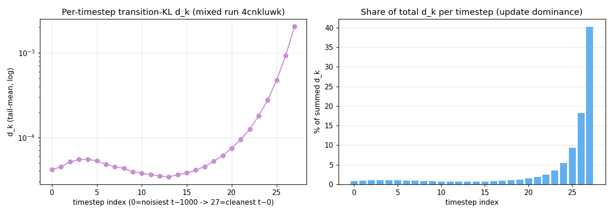

# 2026-07-12 · XOPD 每 timestep d_k 分布（更新主导性）· 客观数据

数据来源：wandb run `4cnkluwk`（`flux2klein_32b_to_4b_l1_geneval_enh_ocr_mixed_1kep`，geneval_enhanced+ocr 1:1 mixed，
FLUX.2-dev 32B → FLUX.2-klein-base-4B，XOPD 纯 L1，`num_inference_steps=28`，`normalize_d_k=false`，
`pathwise_coef=1`、`reinforce_coef=0`、`kl_beta=0`）。

**Loss space：** 该 run 使用默认 `xopd_dk_space="xt"`（transition-mean MSE
`mean‖μ_student − μ_teacher‖²`）。下文「xt」为**实测**；「v」「x0」为按官方 FLUX.2-klein 28-step
scheduler 的 ODE 精确换算（同一 underlying velocity gap）：
`L_v,k = L_xt,k / Δt_k²`，`L_x0,k = (σ_k/Δt_k)² · L_xt,k`。
详见 [`../per_timestep_loss_dominance_theory.tex`](../per_timestep_loss_dominance_theory.tex) §1、§4。

指标：`train/d_k/{ti}` = 第 `ti` 步的 per-step loss（xt 空间下即上式 `L_xt`）。
`mean_tail` = 最近 30% 已记录 optimizer step 的均值；`% of tail-sum` = 该步 `mean_tail` 占 28 步之和的比例。
索引约定：`ti=0` 最噪（t≈1000）→ `ti=27` 最干净（末步 t≈192, σ≈0.19）。聚合值：`train/d_k=1.865e-4`、`train/loss=1.865e-4`、`grad_norm=1.83e-4`。

## 图：每 timestep d_k（左：log-y 折线；右：占总 d_k 比例）

## 表 1 · 每 timestep xt（实测）与 v / x0（换算）

| ti | xt mean_tail | xt % | v mean_tail (conv.) | v % | x0 mean_tail (conv.) | x0 % |
|---:|---:|---:|---:|---:|---:|---:|
| 0 | 4.149e-05 | 0.8% | 1.260e+00 | 12.4% | 1.260e+00 | 13.6% |
| 1 | 4.490e-05 | 0.9% | 1.204e+00 | 11.8% | 1.191e+00 | 12.9% |
| 2 | 5.141e-05 | 1.0% | 1.213e+00 | 11.9% | 1.184e+00 | 12.8% |
| 3 | 5.483e-05 | 1.1% | 1.133e+00 | 11.1% | 1.092e+00 | 11.8% |
| 4 | 5.509e-05 | 1.1% | 9.924e-01 | 9.7% | 9.428e-01 | 10.2% |
| 5 | 5.289e-05 | 1.0% | 8.266e-01 | 8.1% | 7.733e-01 | 8.4% |
| 6 | 4.807e-05 | 0.9% | 6.484e-01 | 6.4% | 5.966e-01 | 6.4% |
| 7 | 4.509e-05 | 0.9% | 5.219e-01 | 5.1% | 4.717e-01 | 5.1% |
| 8 | 4.309e-05 | 0.8% | 4.254e-01 | 4.2% | 3.770e-01 | 4.1% |
| 9 | 3.918e-05 | 0.8% | 3.278e-01 | 3.2% | 2.843e-01 | 3.1% |
| 10 | 3.780e-05 | 0.7% | 2.661e-01 | 2.6% | 2.254e-01 | 2.4% |
| 11 | 3.610e-05 | 0.7% | 2.121e-01 | 2.1% | 1.751e-01 | 1.9% |
| 12 | 3.498e-05 | 0.7% | 1.701e-01 | 1.7% | 1.364e-01 | 1.5% |
| 13 | 3.425e-05 | 0.7% | 1.366e-01 | 1.3% | 1.060e-01 | 1.1% |
| 14 | 3.626e-05 | 0.7% | 1.173e-01 | 1.2% | 8.784e-02 | 0.9% |
| 15 | 3.805e-05 | 0.7% | 9.878e-02 | 1.0% | 7.097e-02 | 0.8% |
| 16 | 4.114e-05 | 0.8% | 8.458e-02 | 0.8% | 5.799e-02 | 0.6% |
| 17 | 4.522e-05 | 0.9% | 7.257e-02 | 0.7% | 4.714e-02 | 0.5% |
| 18 | 5.221e-05 | 1.0% | 6.434e-02 | 0.6% | 3.924e-02 | 0.4% |
| 19 | 6.106e-05 | 1.2% | 5.671e-02 | 0.6% | 3.211e-02 | 0.3% |
| 20 | 7.481e-05 | 1.5% | 5.125e-02 | 0.5% | 2.654e-02 | 0.3% |
| 21 | 9.460e-05 | 1.9% | 4.662e-02 | 0.5% | 2.165e-02 | 0.2% |
| 22 | 1.247e-04 | 2.4% | 4.291e-02 | 0.4% | 1.738e-02 | 0.2% |
| 23 | 1.796e-04 | 3.5% | 4.165e-02 | 0.4% | 1.413e-02 | 0.2% |
| 24 | 2.759e-04 | 5.4% | 4.128e-02 | 0.4% | 1.103e-02 | 0.1% |
| 25 | 4.754e-04 | 9.3% | 4.348e-02 | 0.4% | 8.231e-03 | 0.1% |
| 26 | 9.250e-04 | 18.2% | 4.824e-02 | 0.5% | 5.271e-03 | 0.1% |
| 27 | 2.048e-03 | 40.2% | 5.552e-02 | 0.5% | 2.048e-03 | 0.0% |

## 表 2 · Top-k 累计占比（三种 loss space）

| 聚合 | xt (meas.) | v (conv.) | x0 (conv.) |
|---|---:|---:|---:|
| top-1 步（ti 27） | 40.2% | 0.5% | 0.02% |
| top-2 步（ti 26–27） | 58.4% | 1.0% | 0.08% |
| top-4 步（ti 24–27，后 1/7） | 73.2% | 1.8% | 0.29% |
| top-7 步（ti 21–27，后 1/4） | 81.0% | 3.1% | 0.86% |
| top-14 步（ti 14–27，后 1/2） | 88.9% | 8.5% | 4.8% |
| 高噪半区（ti 0–13） | 12.2% | 91.5% | 95.2% |
| 低噪半区（ti 14–27） | 87.8% | 8.5% | 4.8% |

## 观察（仅陈述）
- **xt（实测）：** d_k 在 `ti≈12–13` 达最小，随后向 `ti=27` 近似指数增长；末步占 ~40%，后 1/4 步占 ~81%。
- **v / x0（换算）：** 同一 run 的 underlying velocity gap 在高噪端更大；换算后 **91–95%** 的质量落在 `ti=0–13`，末步仅 **0.5% / 0.02%**。晚期 xt 主导是 **Δt² 度量效应**，不是 velocity 本身在后期更大。
- 换算使用 FLUX.2-klein-base-4B 官方 scheduler、`num_inference_steps=28`、512px 的 `(σ_k, Δt_k)`（见 theory doc §2）。
