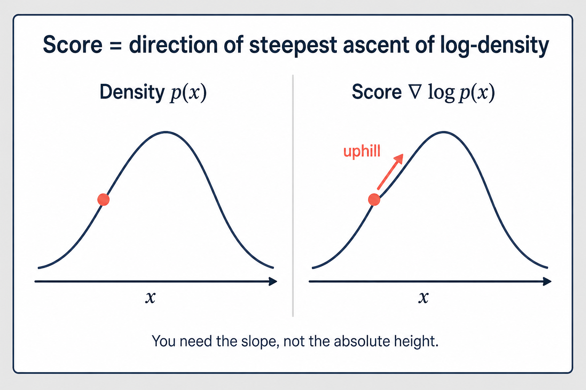
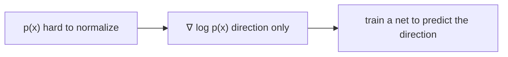
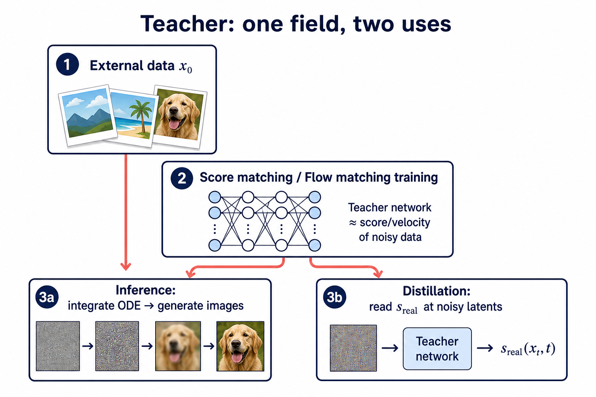
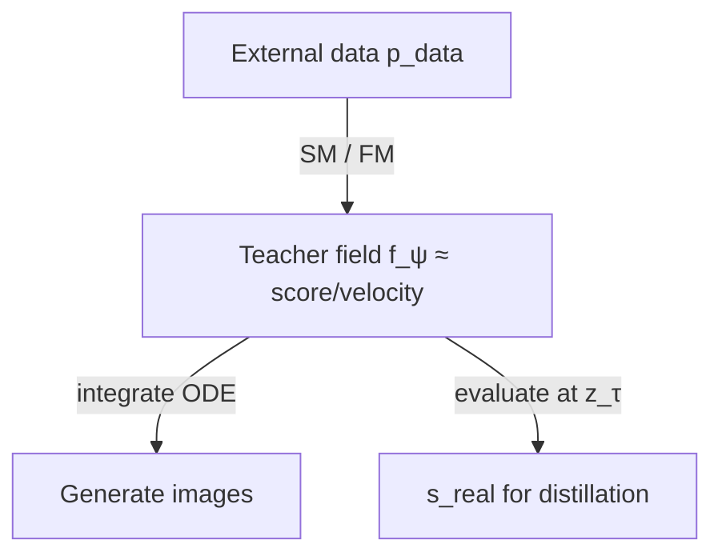
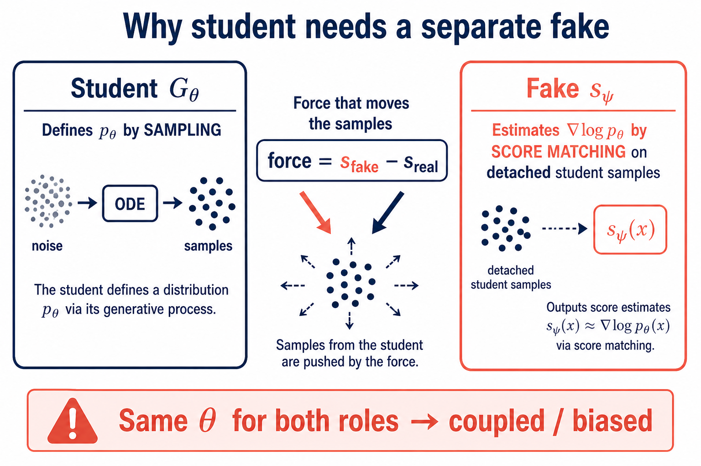
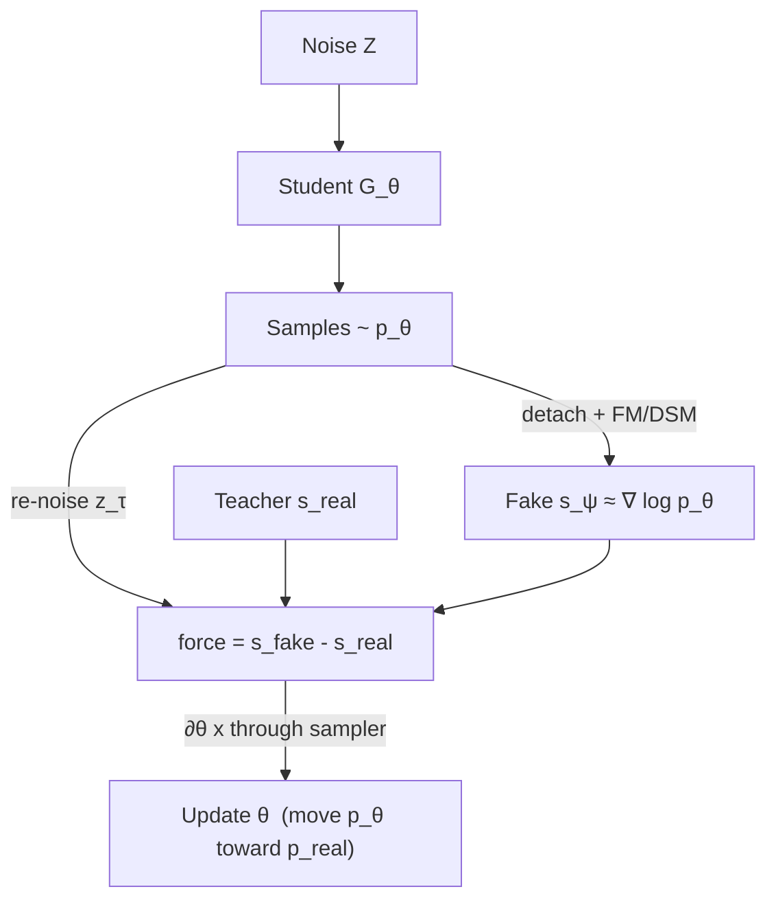
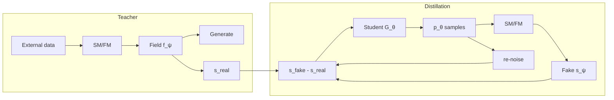

# Score Matching Primer: Why Teacher Can Do Both, and Why Student Needs a Fake

Author: Jayce-Ping  
Date: 2026-08-02  

Audience: readers who know Flow-Factory’s OPD / DMD / TDM vocabulary but may not
have a score-matching background.  
Companions: [`dmd_opd_gradient_relation.tex`](dmd_opd_gradient_relation.tex),
[`tdm_opd_dm_gradient_relation.tex`](../trajectory_dm/tdm_opd_dm_gradient_relation.tex),
[`approach_b_trajectory_dm_design.md`](../trajectory_dm/approach_b_trajectory_dm_design.md).

---

## 0. The question this note answers

During DMD / TDM / Approach B we keep three roles:

| role | typical weights | job |
|------|-----------------|-----|
| **real** (teacher) | frozen 32B | provide \(s_{\mathrm{real}}\approx\nabla\log p_{\mathrm{real}}\) |
| **student** | klein + LoRA `default` | sampler \(G_\theta\) that defines \(p_\theta\) |
| **fake** | klein + LoRA `fake` | provide \(s_{\mathrm{fake}}\approx\nabla\log p_\theta\) |

People often ask:

1. Teacher can **generate** and also **estimate score**. Why can’t the student?
2. \(p_\theta\) is **defined** by the student sampler. Isn’t the definer the most
   unbiased score estimator?
3. Fake is also a flow network — can’t it just replace the student at inference?

This note builds the answer from first principles (density → score → score
matching → generation → distillation), with figures and runnable toy code.

---

## 1. Density is hard; score is a direction

Let \(p(x)\) be a probability density on latents (or pixels).

- **Density** \(p(x)\): “how much mass is here?” — in high dimension we almost
  never know the normalizing constant.
- **Score** \(\nabla_x\log p(x)\): “which way does log-density increase, and how
  steeply?” — a vector field with the **same shape as \(x\)**, and it does **not**
  need the normalizing constant.



*Figure 1. Density is the mountain height; score is the uphill direction at a
point. Distillation cares about directions (scores), not absolute heights.*



---

## 2. Score matching / flow matching: learn the direction from data

We cannot label “true score” for each \(x\). Denoising score matching (DSM) and
rectified-flow / flow matching (FM) use a **construction**:

```text
1. Sample clean data x0 ~ p_data          (external photos / latents)
2. Add noise:  x_t = (1-σ) x0 + σ ε       ε ~ N(0,I)
3. Train a network f_ψ(x_t, t) to predict
   something equivalent to the score / velocity of the noisy marginal p_t
```

Intuition: if you repeatedly ask “from this noisy point, which way is clean
data?”, a network that answers well has learned \(\nabla\log p_t\).

### 2.1 Tiny 1D toy (runnable)

```python
import torch
import torch.nn as nn

# True "data": mixture of two Gaussians (stand-in for real images)
def sample_x0(n, device="cpu"):
    mix = torch.randint(0, 2, (n,), device=device)
    means = torch.tensor([-2.0, 2.0], device=device)
    return means[mix] + 0.3 * torch.randn(n, device=device)

class ScoreNet(nn.Module):
    def __init__(self):
        super().__init__()
        self.net = nn.Sequential(nn.Linear(2, 64), nn.SiLU(), nn.Linear(64, 1))

    def forward(self, x_t, sigma):
        # input: [x_t, sigma]
        return self.net(torch.stack([x_t, sigma], dim=-1)).squeeze(-1)

def train_score(steps=2000, batch=256, lr=1e-3, device="cpu"):
    """Denoising score matching in 1D RF form: predict velocity v* = ε - x0."""
    net = ScoreNet().to(device)
    opt = torch.optim.Adam(net.parameters(), lr=lr)
    for _ in range(steps):
        x0 = sample_x0(batch, device)
        sigma = torch.rand(batch, device=device)           # σ ∈ (0,1)
        eps = torch.randn(batch, device=device)
        x_t = (1 - sigma) * x0 + sigma * eps
        v_target = eps - x0                               # RF velocity target
        v_pred = net(x_t, sigma)
        loss = ((v_pred - v_target) ** 2).mean()
        opt.zero_grad()
        loss.backward()
        opt.step()
    return net

# After training, net(x_t, σ) ≈ velocity of the *data* noisy marginal.
# That velocity can be converted to an x0 estimate / score proxy.
```

**Takeaway:** a network becomes a score/velocity estimator **because it was
trained with SM/FM on external samples**, not because it can sample.

---

## 3. Why the same teacher field can also generate

Once \(f_\psi\) approximates the data’s velocity/score field, generation is:

```text
start from pure noise
repeat: ask f_ψ for velocity; take an Euler / ODE step
arrive near clean samples
```



*Figure 2. Teacher pretrained on external data: one field, two uses — ODE
sampling at inference, and \(s_{\mathrm{real}}\) during distillation.*



So teacher is **not** “defining \(p_{\mathrm{data}}\) by sampling”.  
Data is external; the network **approximates** its score; sampling **reuses** that
approximation.

| | Teacher pretraining |
|--|--|
| Where does the distribution come from? | **Outside** (dataset) |
| Why does the net look like a score? | Trained with **SM/FM on that data** |
| Why can it generate? | Integrate the **same** learned field |

---

## 4. What “\(p_\theta\) is defined by the student” actually means

In DMD / TDM, the student parameters \(\theta\) induce a distribution by
**sampling**:

\[
p_\theta \;:=\; \mathrm{Law}\big(G_\theta(Z)\big),\qquad Z\sim\mathcal{N}(0,I).
\]

\(G_\theta\) may be a multi-step ODE or a consistency few-step map. This is a
**measure-theoretic definition**: “\(p_\theta\) is whatever comes out of the
sampler.”

It does **not** mean:

> “A forward pass of the student UNet at an arbitrary point \(x\) equals
> \(\nabla\log p_\theta(x)\).”

### 4.1 Analogy (GAN)

- Generator \(G_\theta(z)\) **defines** \(p_\theta=\mathrm{Law}(G_\theta(z))\).
  To sample from \(p_\theta\), \(G_\theta\) is indeed the gold standard.
- That same forward pass does **not** output \(\nabla\log p_\theta(x)\). You need a
  discriminator, energy model, or a **score network trained on \(G_\theta\)’s
  samples**.

Flow student: same split.

| Claim | True? |
|-------|-------|
| Student sampler is the gold way to get \(x\sim p_\theta\) | **Yes** |
| Student UNet forward is automatically \(\nabla\log p_\theta\) | **No** |

“Definer = most unbiased estimator” applies to **sampling**, not to **score
functions**.

---

## 5. Fake network: score matching on *student* samples

We need \(\nabla\log p_\theta\) for reverse-KL-style distillation:

\[
\nabla_\theta\mathrm{KL}(p_\theta\|p_{\mathrm{real}})
\;\propto\;
\mathbb{E}\big[(s_{\mathrm{fake}}-s_{\mathrm{real}})\,\partial_\theta x\big].
\]

Recipe:

```text
① Sample x ~ p_θ with the student (detach — stop grad into this copy)
② Noise: z_τ = (1-σ) x + σ ε
③ Train fake ψ with FM/DSM on those (z_τ, x) pairs
   → s_ψ ≈ ∇ log p_θ  (noisy marginal of the *student* distribution)
④ Teacher provides s_real ≈ ∇ log p_real
⑤ Push the *live* student samples with (s_fake - s_real)
```



*Figure 3. Student defines \(p_\theta\) by sampling; fake estimates
\(\nabla\log p_\theta\) by score matching on detached student samples. The DM
force is \(s_{\mathrm{fake}}-s_{\mathrm{real}}\).*



### 5.1 Code sketch aligned with Flow-Factory

```python
# Pseudocode matching XDMD / XTrajectoryDMTrainer roles

def fake_step(fake_net, x_student_detached, t):
    """Score matching / FM on student samples (manual-DP optimizer in real code)."""
    eps = torch.randn_like(x_student_detached)
    sigma = t  # schematically in [0,1]
    z_t = (1 - sigma) * x_student_detached + sigma * eps
    v_target = eps - x_student_detached
    v_pred = fake_net.predict_velocity(z_t, t)
    return ((v_pred - v_target) ** 2).mean()


def generator_dm_step(student, teacher, fake_net, z_noise):
    """Distribution matching: force on sample x = G_θ(z), fake/teacher under no_grad."""
    x = student.sample_one_diff_step(z_noise)          # ∂θ x lives here
    with torch.no_grad():
        t = sample_tau()
        z_dm = (1 - t) * x.detach() + t * torch.randn_like(x)
        x0_real = teacher.predict_x0(z_dm, t)
        x0_fake = fake_net.predict_x0(z_dm, t)
        p_real = x - x0_real
        p_fake = x - x0_fake
        grad = (p_real - p_fake) / p_real.abs().mean()  # DMD2 self-norm (schematic)
    # stop-grad identity: ∂loss/∂x = grad
    target = (x - grad).detach()
    loss = 0.5 * ((x - target) ** 2).mean()
    return loss
```

In-repo pointers:

- Fake FM update: [`dmd_trainer.py`](../../../src/flow_factory/trainers/xopd/dmd_trainer.py) `_dmd_fake_step`
- Traj-DM (Approach B / TDM): [`traj_dm_trainer.py`](../../../src/flow_factory/trainers/xopd/traj_dm_trainer.py) `_tdm_fake_step`, `_tdm_generator_step`
- Stop-grad helper: [`traj_dm.py`](../../../src/flow_factory/trainers/xopd/traj_dm.py) `dm_stopgrad_loss`

---

## 6. Why “let the student be its own fake” fails

Suppose we set \(s_{\mathrm{fake}} :=\) student forward at \(z_\tau\) (same \(\theta\)).

### 6.1 Wrong training objective

During DMD the student is updated by **distribution-matching forces**, not by
“FM on its own samples until \(v_\theta=\nabla\log p_\theta\)”.  
Without an SM objective on \(p_\theta\), there is **no reason** for \(v_\theta\) to equal
the score of the pushforward measure \(p_\theta\).

(The teacher *can* play both roles because pretraining **was** SM/FM on
external data.)

### 6.2 Coupled updates break the KL derivation

The reverse-KL sketch treats \(s_{\mathrm{fake}}\) as an estimate of \(\nabla\log p_\theta\)
**held fixed** while differentiating through the sample \(x=G_\theta(z)\).  
If the same \(\theta\) also produces \(s_{\mathrm{fake}}\), every DM step moves both the
samples **and** the purported score — the gradient is no longer the intended
KL proxy (see reductions in `dmd_opd_gradient_relation.tex`).

### 6.3 Known collapse

| Pinning | Effect |
|---------|--------|
| `fake ← teacher` | force ≈ 0 |
| `fake ← student` (same map) | reweighted field regression through \(\partial_\theta x\), **not** reverse KL |
| independent online fake | genuine distribution-matching setup |

---

## 7. Can the fake generate images?

**Yes it can run an ODE** (same architecture). **No it should not be the
deployed generator.**

| | Student | Fake |
|--|--|--|
| Trained for | sampling distribution \(p_\theta\to p_{\mathrm{real}}\) | score of **current** student samples |
| Product inference | **Yes** | No (training critic) |
| Analogy | GAN generator | GAN discriminator (also a net, not the product) |

---

## 8. Bridge back to Approach B / TDM

Approach B (`xopd_dm`) and TDM (`xtdm`) still need the same three roles. They
only change **where** along the student ODE you attach the DM force:

```text
OPD grid / K-step ODE
  → pick state x_{t_i} (one Euler step with grad)
  → re-noise as if x_{t_i} were "data" for the standard RF kernel
       z_τ = (1-σ) x_{t_i} + σ ε
  → force = s_fake(z_τ) - s_real(z_τ)
  → push x_{t_i}  (not MSE against teacher velocity at fixed x_t)
```

Treating intermediate \(x_{t_i}\) as the data slot of \(q(z_\tau\mid x_{t_i})\) is the
TDM/DMD engineering convention (score distillation on trajectory marginals),
not a claim that \(x_{t_i}\) is a clean image. See the Approach B design doc.

---

## 9. One-page cheat sheet

```text
Score        = direction of ∇ log p          (no need for Z)
SM / FM      = learn that direction from samples + noise
Teacher      = SM on *external data*  → can score AND generate
p_θ          = Law(student sampler)   → gold for *sampling*
∇ log p_θ    = needs SM on *student samples* → that is the fake
DM force     = (s_fake - s_real) · ∂θ x
Never        = pin fake to student or teacher; drop the third net
```



---

## 10. Further reading in this repo

| Doc | Focus |
|-----|--------|
| [`dmd_opd_gradient_relation.tex`](dmd_opd_gradient_relation.tex) | OPD vs DMD Jacobians; fake-pinning collapses |
| [`tdm_opd_dm_gradient_relation.tex`](../trajectory_dm/tdm_opd_dm_gradient_relation.tex) | Approach B vs TDM |
| [`dmd_cross_model_design.md`](dmd_cross_model_design.md) | XDMD engineering |
| [`approach_b_trajectory_dm_design.md`](../trajectory_dm/approach_b_trajectory_dm_design.md) | `xopd_dm` |
| [`tdm_cross_model_design.md`](../trajectory_dm/tdm_cross_model_design.md) | `xtdm` |

---

## Appendix A. Minimal experiment to internalize the split

Runnable demo (CPU):

```bash
.venv/bin/python docs/xopd/demos/score_matching_fake_toy.py
```

Sketch:

1. Train a 1D net on external mixture data — **teacher**.
2. Define a **student** sampler \(G_\theta(z)=\theta\cdot z\): \(p_\theta\) is a scaled
   Gaussian. Sampling is trivial; \(\theta\) *defines* \(p_\theta\) but is not a score net.
3. Fit a **second** net with FM on samples from \(G_\theta\) — **fake**.
4. On student-noised points, teacher and fake velocities disagree (different
   target distributions) — the gap printed by the demo.
